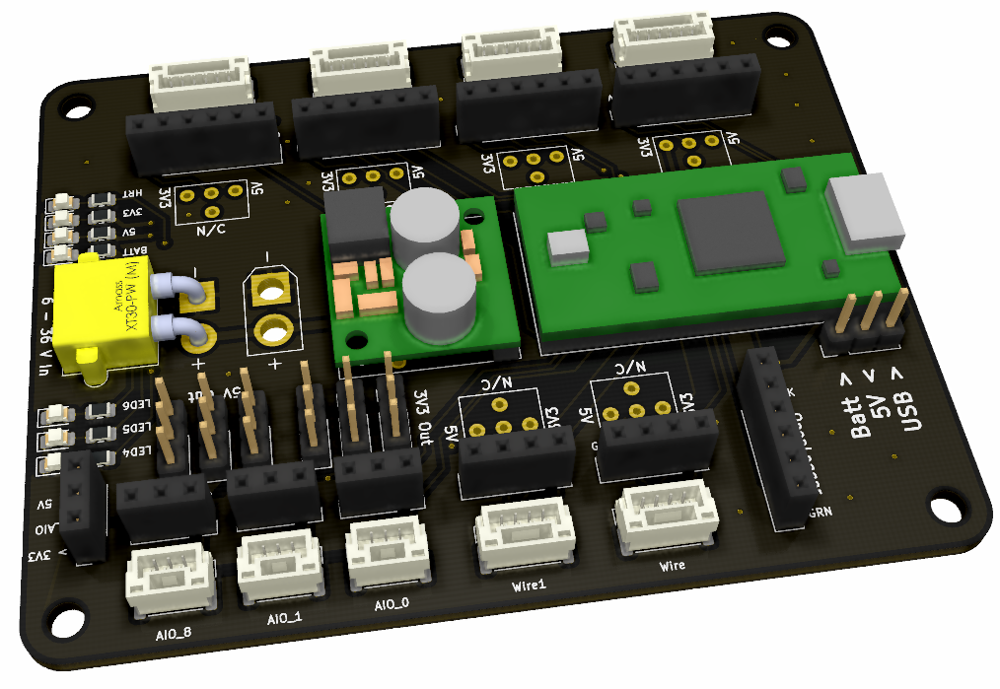

# Teensy 4.0 Breakout
Breakout Board for the Teensy 4.0. The connectors are designed to match the Pixhawk standard connectors, making it easy to interface with different sensors.

Features:
- 6 - 36 V Input
- 2 x Serial ports
- 1 x SPI with 2x CS
- 2 x I2C Ports
- 3 x PWM / ADC


<p align="center">
  
</p>

Make sure to clone recursively!
```
git clone https://github.com/AndersonRayner/teensy_4.0_breakout.git --recursive
```

## Usage
- As the connectors are matching the Pixhawk standard, using the 0.1" headers means you can reverse plug! 
- Power for each of the output rails can be selected using the jumpers (between 3V3 and 5V)

## Contributions
As always, PRs are welcome!
